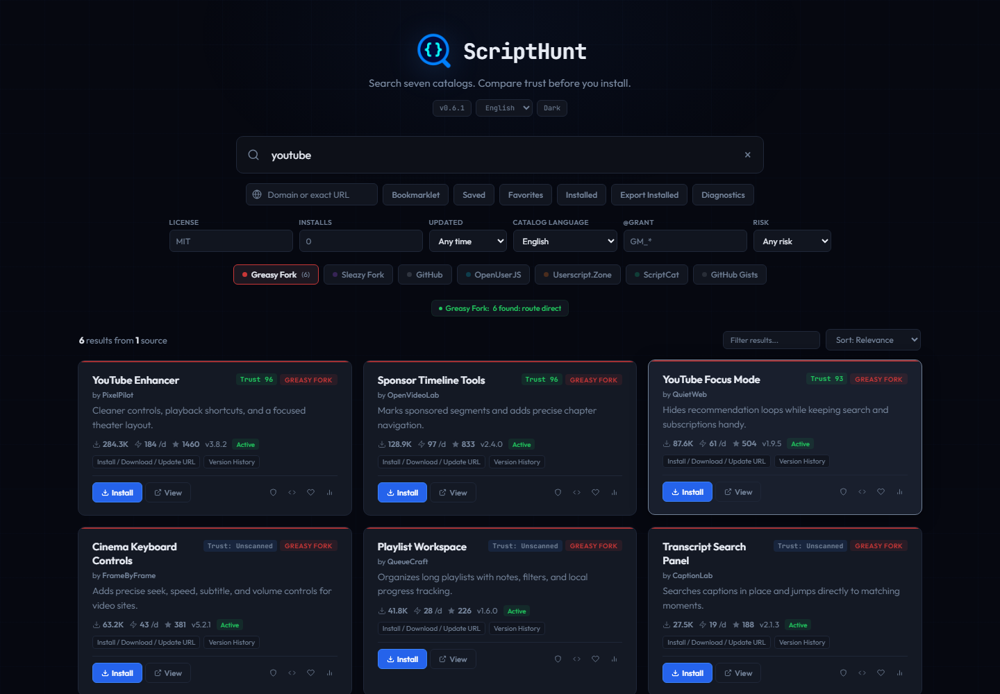
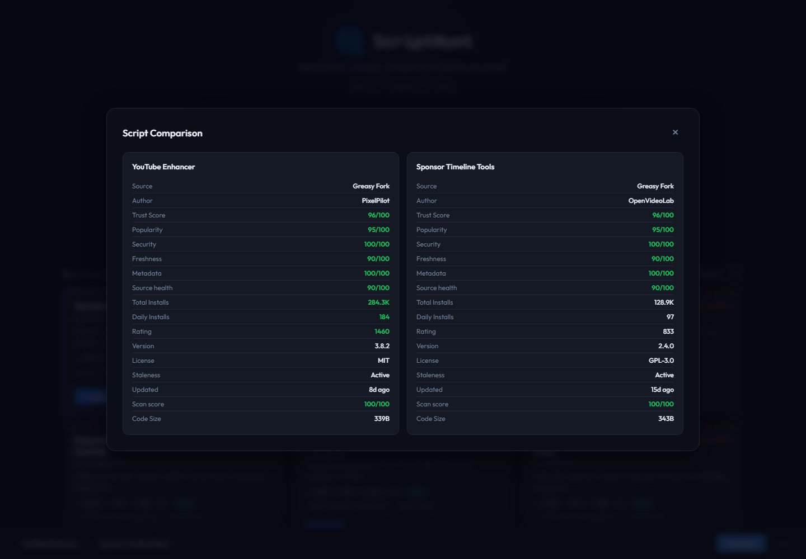
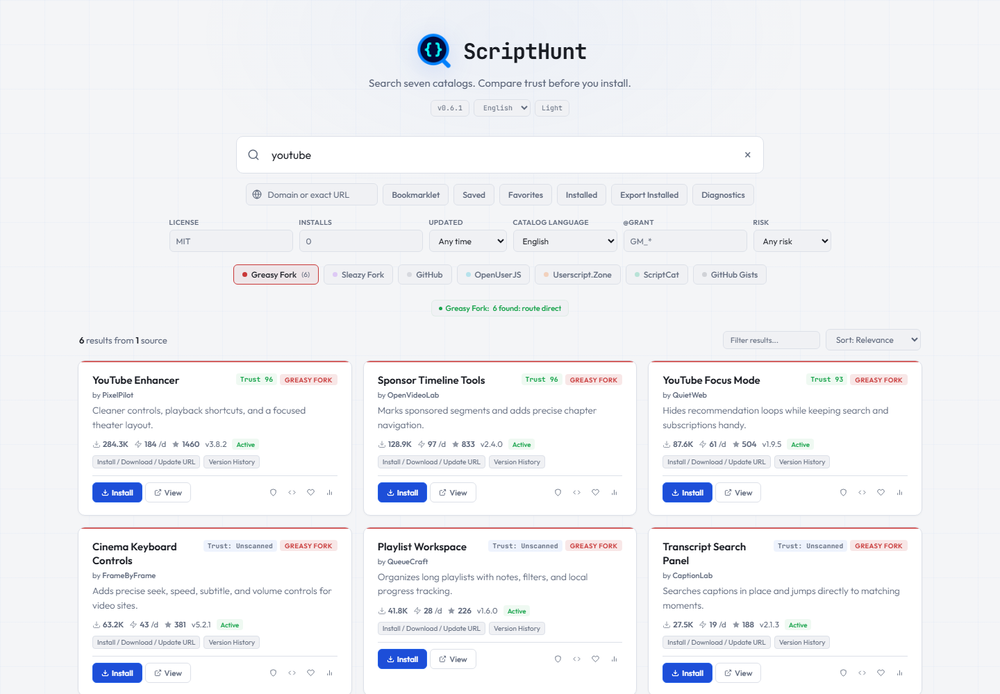
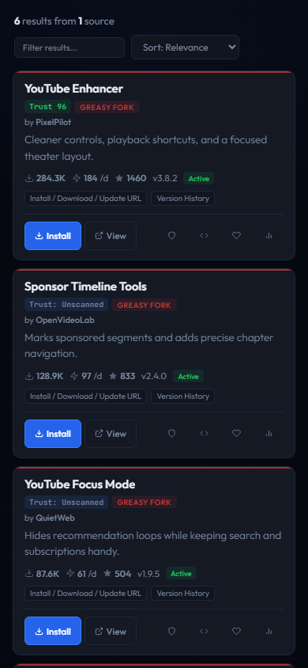

<p align="center">
  
</p>

# ScriptHunt


**Search seven userscript catalogs at once. Compare trust evidence and inspect metadata before you install.**

[Open ScriptHunt](https://sysadmindoc.github.io/UserScriptHunt/) · [Try a YouTube search](https://sysadmindoc.github.io/UserScriptHunt/?q=youtube+enhancer) · [Download the latest release](https://github.com/SysAdminDoc/UserScriptHunt/releases/latest)



ScriptHunt is a private, installable web app for finding userscripts without checking one catalog at a time. It merges results in the browser, keeps the source attached to every record, and shows what it could verify. There is no account and no analytics.

## Why people use it

- Search Greasy Fork, Sleazy Fork, GitHub, OpenUserJS, Userscript.Zone, ScriptCat, and GitHub Gists from one query.
- Compare popularity, freshness, permissions, source health, and scan results without losing provenance.
- Inspect userscript metadata and code patterns before opening an install URL. ScriptHunt never executes fetched scripts.
- Keep favorites, saved searches, installed records, and recent results in local browser storage.

## See it in action

| Compare candidates | Light theme |
|---|---|
|  |  |

Screenshots use fixed sample responses so the documented states remain reproducible.

The interface also includes dark, OLED black, and automatic themes. It works down to a 320 pixel viewport and can be installed as a Progressive Web App.

<p align="center">
  
</p>

## Start searching

The hosted app is ready at [sysadmindoc.github.io/UserScriptHunt](https://sysadmindoc.github.io/UserScriptHunt/). Enter a keyword, domain, or exact page URL. Results arrive progressively as each enabled source responds.

Useful query operators:

| Operator | Example | What it does |
|---|---|---|
| `site:` | `site:youtube.com` | Finds scripts that target a domain |
| `author:` | `author:PixelPilot` | Limits results to an author |
| `updated:` | `updated:90d` | Limits results by age |
| `grant:` | `grant:GM_xmlhttpRequest` | Filters by userscript permission |

Visible controls cover license, install count, catalog language, risk, and updated date. Search state can be shared through URL parameters.

## Trust evidence, not a safety promise

ScriptHunt labels missing evidence instead of treating it as safe. A trust score combines the information that is available for a result, including source health, popularity, freshness, metadata quality, and an optional code scan.

The scanner fetches a userscript as text and checks metadata plus known risky patterns. It records the response URL, HTTP status, fetch time, content hash, and cache age. It does not run the code. A clean result means no configured pattern was found, not that the script is guaranteed safe. Read unfamiliar code and review requested permissions before installing it.

Dependency checks are also non-executing. They can verify declared hashes, flag floating URLs, and detect changed content for bounded `@require` and `@resource` requests.

## Supported sources

| Source | Method | Route | Auth Required | CORS | Per-Page | Capabilities | Metadata |
|--------|--------|-------|:---:|:---:|:---:|--------------|----------|
| **Greasy Fork** | JSON API + by-site.json | direct | No | Native (`*`) | 100 | search, pagination, totals, site filter, install URLs | Installs, ratings, version, dates, license, author |
| **Sleazy Fork** | JSON API | direct | No | Native (`*`) | 100 | search, pagination, totals, site filter, install URLs | Installs, ratings, version, dates, license, author |
| **GitHub** | REST API v3 + Code Search | direct | Optional token | Native CORS | 30 | repository search, authenticated code search, pagination, totals | Stars, forks, language, license, dates |
| **OpenUserJS** | HTML scraping | custom/public proxy | No | Via proxy | 25 | search, pagination, install URLs | Name, author, install URL |
| **Userscript.Zone** | HTML scraping | custom/public proxy | No | Via proxy | 10 | search, pagination, install URLs | Name, description, install URL |
| **ScriptCat** | JSON API v2 | direct | No | Native CORS | 30 | search, pagination, totals, install URLs | Installs, ratings, version, dates, author |
| **GitHub Gists** | HTML scraping | custom/public proxy | No | Via proxy | 10 | search, pagination, install URLs | Name, author, install URL |

Sleazy Fork and GitHub Gists are off by default. GitHub repository search works without a token. An optional token enables higher limits and file-level code search, stays in session storage, and disappears when the browser tab closes.

OpenUserJS, Userscript.Zone, and Gist search need a CORS proxy. Public fallback services receive the target search or script URL. You can disable public fallback and configure the included allowlisted Cloudflare Worker from Diagnostics.

## Install the app

Open the hosted site in a browser with PWA support, then choose its install action. The installed app keeps the interface shell available offline. Recent cached searches can be reopened with their source and scan evidence.

To self-host the static app:

```bash
git clone https://github.com/SysAdminDoc/UserScriptHunt.git
cd UserScriptHunt
python -m http.server 8000
```

Open `http://localhost:8000`. A local server is recommended because service workers do not run from `file://` pages.

GitHub Pages can serve the repository directly from the `main` branch root. No build step is required.

## Local data and recovery

Preferences and small lists use localStorage. Recent searches and scan records prefer IndexedDB, with a localStorage fallback. Imports are validated before they change data, and ScriptHunt creates a local recovery snapshot before replacing favorites or installed records.

Diagnostics can clear search and scan caches without removing favorites, installed records, saved searches, or credentials. Export important lists before clearing browser storage.

## Development

Install the pinned test dependency and run the local verification suite:

```bash
npm ci
npm run test:install
npm run qa
```

`npm run qa` runs the package security audit, Worker tests, version and source documentation checks, and the browser suite. The browser tests mock catalog responses and run headlessly against the repository's local static server.

Regenerate the checked-in product images with:

```bash
npm run capture:marketing
```

Create the release ZIP and checksum with:

```powershell
npm run release:package
```

The app uses vanilla HTML, CSS, and JavaScript. Runtime fonts are vendored under the SIL Open Font License. The optional CORS proxy lives in `cors-proxy/worker.js`.

## Add a source

Built-in sources use a shared adapter contract. Each adapter returns normalized result and provenance records, so the search, filter, cache, and diagnostics layers do not need source-specific branches.

Custom sources can be added from Diagnostics with a versioned JSON manifest. The manifest declares a stable identifier, an HTTPS request template, response paths, field mappings, and strict time and size limits. Custom JavaScript is never evaluated.

## Related project

[UserScript-Finder](https://github.com/SysAdminDoc/UserScript-Finder) adds a menu command to Tampermonkey and Violentmonkey for finding scripts made for the page you are viewing. ScriptHunt is the broader catalog search and comparison app.

## License

ScriptHunt is available under the [MIT License](LICENSE).
